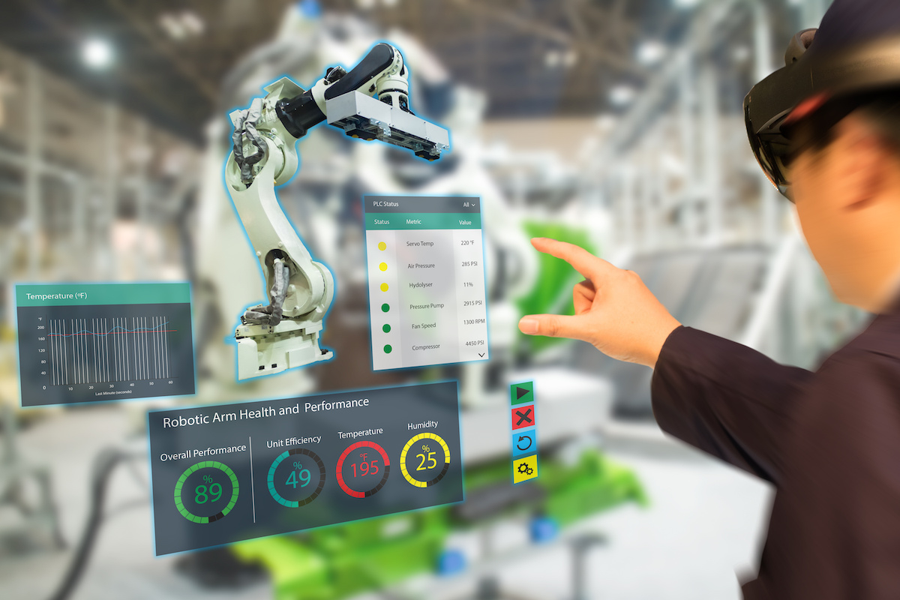

## What is Computer Graphics?

Computer Graphics is a sub-field of Computer Science that focuses on developing techniques for digitally creating, synthesizing, and manipulating visual content.

{alt="Text"}

The term often refers to the study of both two-dimensional and three-dimensional graphics, 
encompassing a wide range of visual content such as images, video, and 3D meshes.

To stay updated on the latest developments, two key events are of interest:

- [Special Interest Group on Computer Graphics and Interactive Techniques Conference - SIGGRAPH/](https://s2024.siggraph.org/)
- [Eurographics](https://eg2024.cyens.org.cy/)

### Sample papers of interest:
- [SIGGRAPH papers](https://dl.acm.org/conference/siggraph/proceedings), including some examples of interest:
  - Nahomi Maki. 2024. 360° Animation Projects by Students with a Background in Traditional Stop-Motion Techniques. In ACM SIGGRAPH 2024 Educator's Forum (SIGGRAPH '24). Association for Computing Machinery, New York, NY, USA, Article 19, 1–2. [https://doi.org/10.1145/3641235.3664439](https://dl.acm.org/doi/10.1145/3641235.3664439)
  - Taina Ribeiro de Oliveira, Matheus Moura da Silva, Rafael Antonio Nepomuceno Spinasse, Gabriel Giesen Ludke, Mateus Ruy Soares Gaudio, Guilherme Iglesias Rocha Gomes, Luan Guio Cotini, Daniel Vargens, MARCELO QUEIROZ SCHIMIDT, Rodrigo Varejao Andreao, and Mario Mestria. 2022. Systematic Review of Virtual Reality Solutions Employing Artificial Intelligence Methods. In Symposium on Virtual and Augmented Reality (SVR'21). Association for Computing Machinery, New York, NY, USA, 42–55. [https://doi.org/10.1145/3488162.3488209](https://dl.acm.org/doi/10.1145/3488162.3488209)
  - Llogari Casas and Kenny Mitchell. 2023. Intermediated Reality with an AI 3D Printed Character. In ACM SIGGRAPH 2023 Real-Time Live! (SIGGRAPH '23). Association for Computing Machinery, New York, NY, USA, Article 5, 1–2. [https://doi.org/10.1145/3588430.3597251](https://dl.acm.org/doi/10.1145/3588430.3597251)
  - Zhigeng Pan, Zhipeng Pan, Tianren Luo, and Mingmin Zhang. 2023. Exploring the Use of Smartphones as Input Devices for the Mixed Reality Environment. In Proceedings of the 18th ACM SIGGRAPH International Conference on Virtual-Reality Continuum and its Applications in Industry (VRCAI '22). Association for Computing Machinery, New York, NY, USA, Article 33, 1–7. [https://doi.org/10.1145/3574131.3574451](https://dl.acm.org/doi/10.1145/3574131.3574451)
- [Eurographics Digital Library](https://diglib.eg.org/handle/10.2312/2633290), including some examples of interest: 
  - [Building Augmented and Virtual Reality Experiences for Children with Visual Diversity](https://diglib.eg.org/handle/10.2312/cgvc20221175)
  - [Visualization and Graphics in Mixed Reality](https://diglib.eg.org/handle/10.2312/egt20211036)
  - [Virtual Instrument Performances (VIP): A Comprehensive Review](https://diglib.eg.org/items/005fdb22-e373-4425-9a73-997f70f5db95)

::::::::::::::::::::::::::::::::::::: keypoints 

- Computer graphics is a well established domain. 
- Look at the list of
resources in this section to get an insight into the latest developments
in this area.
::::::::::::::::::::::::::::::::::::::::::::::::

