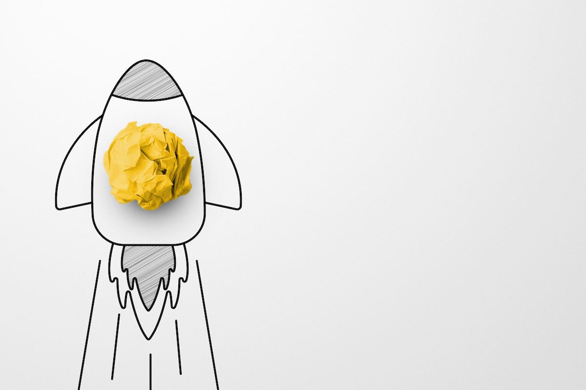

## Module Specification 

{alt="Welcome"}

This support measuring your learning.

On successful completion of the module the student will be able to:

- Deploy methods and techniques for describing Virtual Environments.
- Design and implement Virtual Reality systems on interoperable platforms.
- Demonstrate an awareness of the range of current and potential uses of Virtual Reality Systems.

## Topics
The various topics that we will cover during the module, include but are not limited to:

History and Theory:

- History of Mixed/Virtual Reality systems
- Design methodologies for Mixed Reality Systems
- Designing Graphics User Interfaces (GUI) for VR systems
- Hardware platforms and interoperability
- Interoperability and WebVR
- Virtual Reality rendering, framerates, resolution
- Polygonal meshes and interactions
- 3D sensing and 3D tracking
- Lighting in VR systems
- Testing VR systems

Practical skills for:

- Describing Scenes for Virtual Environments
- Developing Scenes with multi-modal content
- Linking to multi-modal content on the web based on interoperable frameworks
- Deploying Mixed Reality environments
- Implementing Ray Casting and other algorithms for interaction
- Transformations and other movement in 3D scenes

::::::::::::::::::::::::::::::::::::: keypoints 

- You will need to demonstrate three key skills when we assess the module.
- This section introduces you to the [ILO](#module-specification) for the module.
::::::::::::::::::::::::::::::::::::::::::::::::
